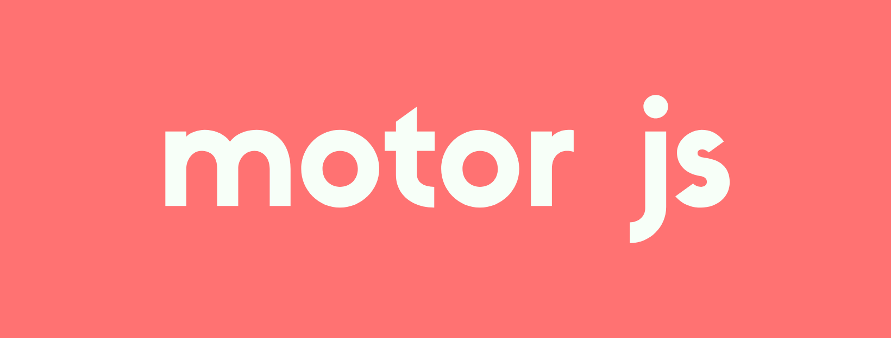

# nebula

## A React wrapper around Nebula.js for easy integration with Motor Mashups 🚀

 

 
## This repo contains no source code. It is used for issue tracking.

#### Find docs, guides, the API and more at  [docs.motor.so](https://docs.motor.so).

#### Looking to generate complete mashups? See our [homepage](https://motor.so).

#### Join our community on [discord](https://discord.com/invite/jmjx78N59b).
